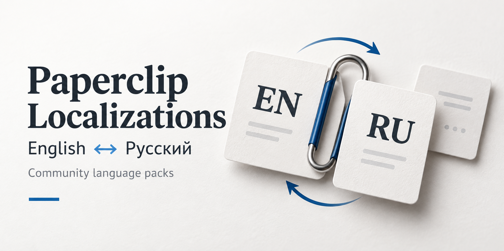

# Paperclip Localizations

[Русский](README.md) · **English**

[](https://github.com/DrMaks22/paperclip-localizations/actions/workflows/ci.yml) · [Stable](https://github.com/DrMaks22/paperclip-localizations/releases/tag/v2026.9.17.1) · [Beta](https://github.com/DrMaks22/paperclip-localizations/releases/tag/v2026.9.13.1-beta.1) · [Channels and verification](docs/RELEASES.md)



An independent community project for translating the [Paperclip](https://github.com/paperclipai/paperclip) interface. English is the source catalog, and Russian is the first translation. This repository distributes catalogs, checks, and a patch for a specific Paperclip revision; it is not an official Paperclip release.

## Choose a channel

| Localization channel | Compatible Paperclip version | Intended use |
| --- | --- | --- |
| [Stable — v2026.9.17.1](https://github.com/DrMaks22/paperclip-localizations/releases/tag/v2026.9.17.1) | Official stable release **v2026.916.0**, commit `dffc2b3` | For that stable version. English and Russian UI. |
| [Beta — v2026.9.13.1-beta.1](https://github.com/DrMaks22/paperclip-localizations/releases/tag/v2026.9.13.1-beta.1) | Reviewed **master snapshot**, commit `04e3642` | Prerelease for testing development code and new language catalogs. |

**Stable and beta are different patches for different source revisions.** Beta does not target the stable release and does not automatically follow master. GitHub Releases reserves `Latest` for stable. Localization version numbers are separate from Paperclip's version numbers.

The previous immutable [stable v2026.9.13.1](https://github.com/DrMaks22/paperclip-localizations/releases/tag/v2026.9.13.1) remains available for Paperclip `v2026.831.1`. See the [v2026.9.17.1 report](https://github.com/DrMaks22/paperclip-localizations/blob/v2026.9.17.1/verification/v2026.9.17.1.md) for verification results and limitations on the new base.

The `main` branch contains beta development. Install a selected **release**, not the moving branch. See the [channel guide](docs/RELEASES.md) for full commits, differences, and verification; [`channels.json`](channels.json) is the machine-readable index.

## Install with an agent

Copy this task into **Codex, Claude Code, or OpenCode**. Replace the path with yours; the pinned release document contains the remaining installation requirements.

```text
Install the Paperclip localization from DrMaks22/paperclip-localizations,
stable release v2026.9.17.1 for Paperclip v2026.916.0.
My original Paperclip Git repository is at
/absolute/path/to/paperclip. Read and follow this release's instructions:
https://github.com/DrMaks22/paperclip-localizations/blob/v2026.9.17.1/docs/AGENT-INSTALL.md
First review the source, manifest.json, checksums, and compatibility.
Prepare a separate worktree at manifest.baseCommit, check and apply the patch,
run the necessary build checks, and report the result.
Deploying to an existing instance requires a separate instruction.
```

This is a plain language task for the agent, not a product specific command. For beta, use the [separate task](docs/RELEASES.md#install-beta-with-an-agent). The agent must not silently change the selected channel or downgrade a running instance. The [agent instructions](docs/AGENT-INSTALL.md) also cover an existing Paperclip installation.

## Install manually

You need **Node.js 24**, Git, and a Paperclip source repository. Download a pinned localization release into a separate directory, then follow the [installation guide](docs/INSTALL.en.md). The main commands, run from the localization directory, are:

```bash
node apply.mjs --repo /absolute/path/to/paperclip-localized --check
node apply.mjs --repo /absolute/path/to/paperclip-localized --apply
```

The target worktree must be clean and match the `baseCommit` in [`manifest.json`](manifest.json) exactly. The installer works offline: it checks and changes source files. Dependencies, the database, startup, and deployment remain part of your normal workflow.

A repeated forward application or `--check` after application will refuse to proceed. Use `--reverse --check` to verify the installed patch, and `--reverse --apply` to remove it. See the [guide](docs/INSTALL.en.md#updating-and-removing-the-patch) for details and the update sequence.

## Compatibility and translation scope

[`manifest.json`](manifest.json) is the source of truth for the supported revision. A release does not promise compatibility with other or future Paperclip versions. Before updating an existing instance, prepare a backup and a separate build. Do not downgrade it to make the patch apply.

The translation covers the catalogs and reviewed interface changes included in the release. A translated catalog alone does not establish that every dynamic screen is fully translated. User content, agent responses, logs, and raw provider diagnostics may remain in their original language.

If Paperclip is installed globally through npm or runs from a prebuilt Docker image, this patch cannot simply be applied to the installed package or container. You need a compatible source build; [installation scenarios](docs/INSTALL.en.md#an-existing-paperclip-instance) are documented separately.

## Add a language or fix a translation

Corrections and new languages are welcome through pull requests to `main`. To add a language, create a raw nested catalog at `locales/<BCP47>.json`, such as `locales/de.json`, using [`locales/en.json`](locales/en.json) as the structural reference. In beta, project tooling infers the language's native display name; you do not need to edit the language switcher manually. Stable uses the `pinned-en-ru` profile for English and Russian; porting new languages to stable requires a separately verified release.

Before merging, changes need checks for keys, placeholders, plural forms, and markup, separate native fluency and bilingual accuracy reviews, and a review of the main screens. Right-to-left languages also require a dedicated visual audit. See [CONTRIBUTING.md](CONTRIBUTING.md) for the full process.

```bash
npm test
npm run validate
```

To report a problem, use the [translation issue form](https://github.com/DrMaks22/paperclip-localizations/issues/new?template=translation.yml) or the [installation issue form](https://github.com/DrMaks22/paperclip-localizations/issues/new?template=installation.yml).

## Updates and attribution

On Mondays, GitHub checks the latest stable Paperclip release and master changes separately. A Codex agent prepares necessary translation and patch updates in separate branches for the respective channels. The weekly Codex task is configured for 10:00 Europe/Moscow. Merging, publishing any release, and deployment require separate maintainer approval. See the [maintenance guide](docs/MAINTENANCE.md) for schedules, automation limits, and release checks.

This work continues contributions from [upstream PR #11125](https://github.com/paperclipai/paperclip/pull/11125): Evyatar Bluzer ([@bluzername](https://github.com/bluzername)), with [@convergentaru](https://github.com/convergentaru) as the original submitter. The follow-up work is proposed upstream in [PR #12989](https://github.com/paperclipai/paperclip/pull/12989); upstream acceptance is not required to use this independent repository. Maintained by [@DrMaks22](https://github.com/DrMaks22). Original authorship and `Co-authored-by` records are preserved; agent review is not presented as human review.

Licensed under [MIT](LICENSE), with Paperclip and original localization attribution preserved.

## Documentation

- [Installation](docs/INSTALL.en.md) · [Установка на русском](docs/INSTALL.ru.md)
- [Instructions for Codex, Claude Code, and OpenCode](docs/AGENT-INSTALL.md)
- [Contributing](CONTRIBUTING.md)
- [Maintenance and releases](docs/MAINTENANCE.md)
- [Stable and beta: compatibility and release selection](docs/RELEASES.md)
- [Contributor and agent rules](AGENTS.md)
